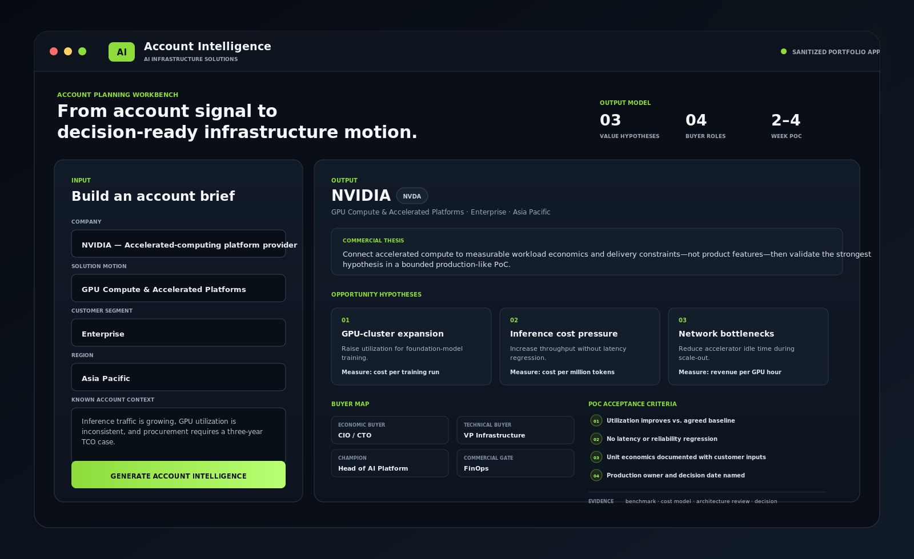
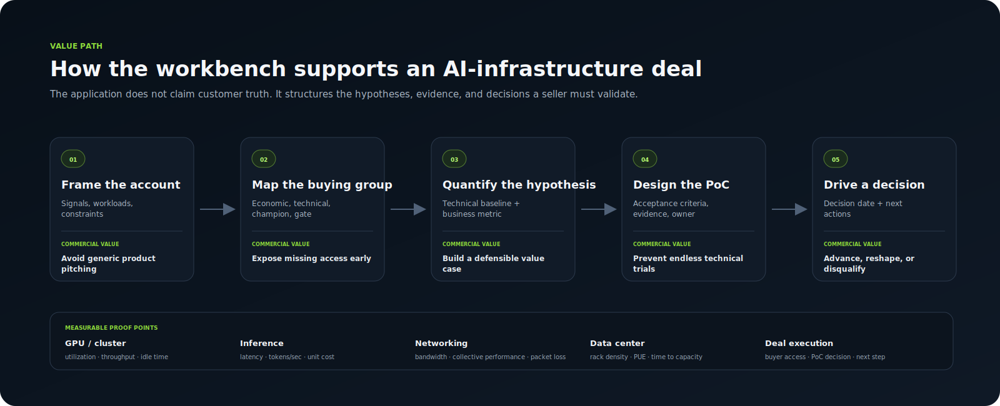
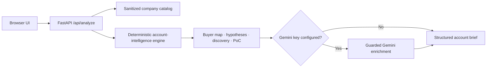

# AI Infrastructure Account Intelligence

[](#)
[](#)
[](#)
[](#)

A sanitized, runnable account-planning application for AI-infrastructure solution selling. It converts a selected company, solution motion, customer segment, and known account context into a structured commercial and technical brief.

The application is designed to move an infrastructure conversation from **generic product positioning** to a **testable account hypothesis, mapped buying group, quantified value path, and decision-oriented PoC**.

## Rendered Product Example

[](docs/assets/account-intelligence-workbench.svg)

The example above uses an enterprise GPU-compute motion. The output connects three infrastructure pressures to measurable proof points, maps four buying roles, and defines a bounded 2–4 week PoC with explicit acceptance criteria.

## What It Produces

| Output | Purpose in the sales motion |
|---|---|
| Account and workload hypotheses | Converts public signals and known context into questions that can be validated with the customer. |
| Economic and technical buyer map | Separates budget ownership, architecture authority, champion access, and commercial approval. |
| Technical-to-business value paths | Connects utilization, throughput, latency, networking, power, or operations to unit economics and delivery outcomes. |
| Discovery questions | Tests whether the pain, urgency, ownership, and decision process are real. |
| Objection map | Prepares evidence-based responses without pretending an objection has already been resolved. |
| Falsifiable PoC criteria | Defines baseline, success measures, evidence, production owner, and decision date before evaluation begins. |
| Next-step plan | Ends with actions that advance, reshape, or disqualify the opportunity. |

## How It Can Drive Deal Value

[](docs/assets/account-intelligence-value-path.svg)

The value is not that the application “knows” the customer. It does not. Its value is that it forces the seller to expose weak thinking before a customer meeting:

- **Qualification:** replaces broad account research with explicit workload, pain, urgency, ownership, and evidence hypotheses.
- **Multi-threading:** shows which buyer role is missing instead of treating “the customer” as one stakeholder.
- **Value engineering:** pairs every technical claim with a measurable operational or financial metric.
- **PoC control:** prevents open-ended technical trials by defining success, evidence, ownership, rollback, and a decision date.
- **Pipeline quality:** creates a clear path to advance, reshape, or disqualify rather than preserving weak opportunities indefinitely.

Representative proof points include GPU utilization, throughput, accelerator idle time, latency, cost per million tokens, fabric performance, rack density, PUE, time to capacity, buyer access, and PoC decision status.

## Application Scope

The built-in catalog covers eleven companies across accelerated compute, semiconductors, AI networking, servers, specialized cloud infrastructure, and data-center power and cooling.

Five solution motions are included:

1. GPU Compute & Accelerated Platforms
2. Cloud AI Platform
3. AI Networking & Interconnect
4. Data Center Power, Cooling & Systems
5. MLOps & Inference Operations

The deterministic engine runs without external services. When `GEMINI_API_KEY` is present, Gemini can refine the narrative using only the structured brief already generated by the application. The model is explicitly instructed not to add deployments, contracts, customer claims, financial results, or current events.

## Architecture



## Design Decisions

| Decision | Implementation |
|---|---|
| Core workflow must work offline | Account hypotheses and sales artifacts are generated deterministically from a versioned catalog. |
| AI must not be the source of truth | Gemini receives the deterministic brief only and is restricted from adding external facts. |
| The output must support a deal motion | Every analysis includes stakeholders, discovery questions, objections, measurable outcomes, and PoC acceptance criteria. |
| Public portfolio must remain sanitized | No customer data, credentials, proprietary integrations, or internal account plans are included. |
| Technical value must connect to economics | Each opportunity hypothesis pairs an infrastructure constraint with a measurable technical and business metric. |

## Project Structure

```text
app.py                         FastAPI routes and request validation
data/catalog.py                Sanitized company and solution-motion catalog
data/account_intelligence.py   Deterministic engine and optional Gemini enrichment
templates/index.html           Server-rendered application shell
static/styles.css              Responsive professional interface
static/app.js                  API interaction and results rendering
tests/                         Offline endpoint and engine tests
docs/architecture.md           Component and control details
docs/assets/                   Product and value-path renderings
```

## Run Locally

```bash
python -m venv .venv
source .venv/bin/activate       # Windows: .venv\Scripts\activate
pip install -r requirements.txt
uvicorn app:app --reload
```

Open `http://127.0.0.1:8000`.

Gemini enrichment is optional:

```bash
cp .env.example .env
export GEMINI_API_KEY="your-key"
export GEMINI_MODEL="gemini-2.5-flash"
```

The application remains fully usable without these variables.

## Test

```bash
pytest -q
```

Tests do not call external APIs.

## Public-Portfolio Boundary

This repository uses generalized public-company categories and synthetic account contexts. It does not contain confidential customer discovery, pricing, contracts, internal forecasts, production credentials, or proprietary data. Generated output is an account-planning hypothesis and must be validated through real customer discovery.

## License

Released under the MIT License.
