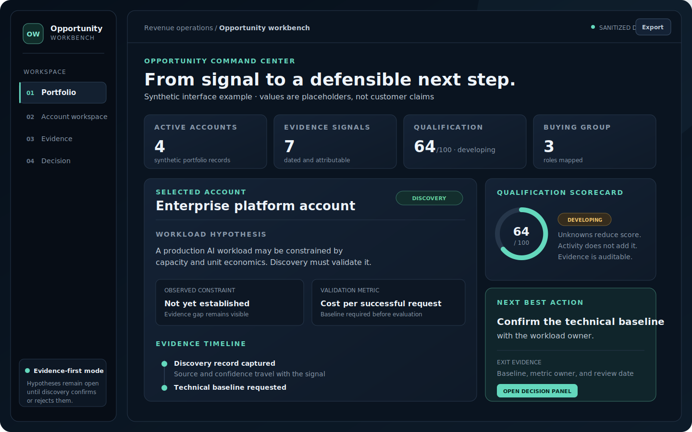
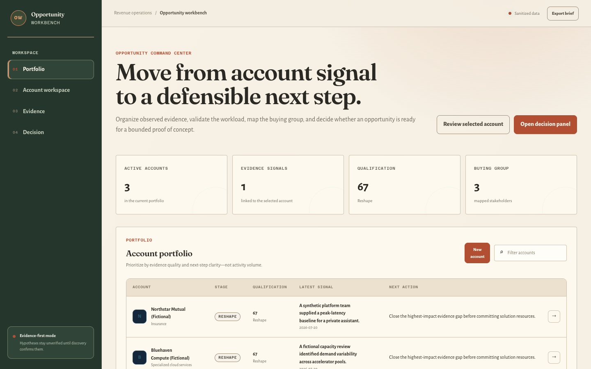
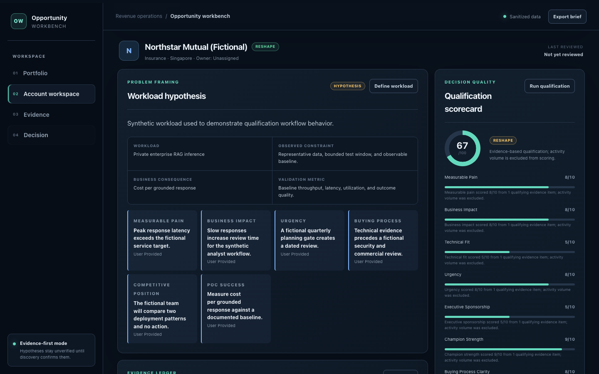
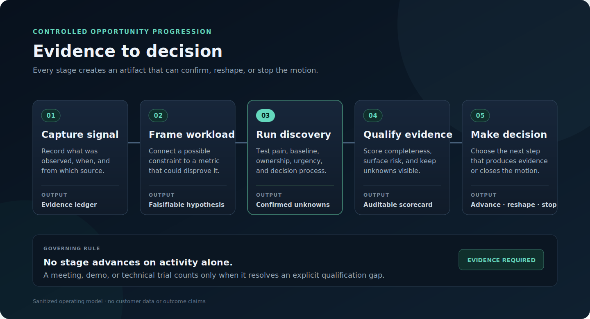
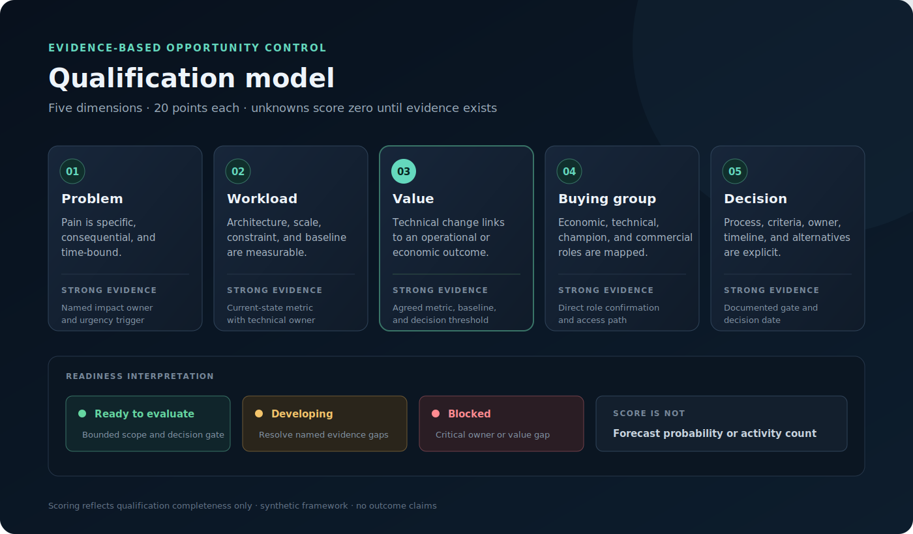
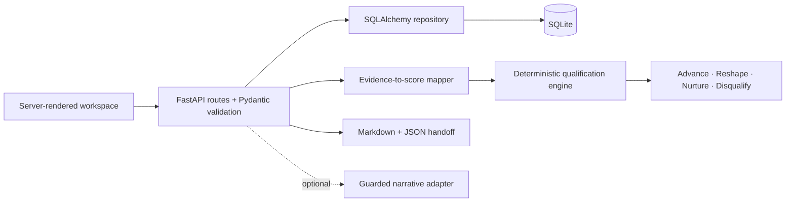

# AI Infrastructure Opportunity & Discovery Workbench

[](https://github.com/daetan999/ai-infra-opportunity-workbench/actions/workflows/ci.yml)
[](https://www.python.org/)
[](https://fastapi.tiangolo.com/)
[](#verification)
[](LICENSE)



A runnable deal-qualification workspace for complex AI-infrastructure opportunities. It turns discovery evidence into a transparent qualification score, an explicit advance/reshape/nurture/disqualify recommendation, and a bounded proof-of-concept handoff.

This is a portfolio implementation built with synthetic scenarios. It demonstrates the technical and commercial reasoning used to qualify accelerator, networking, capacity, and AI-platform opportunities without representing real customers, deployments, revenue, or pipeline.

## Visual system

The workbench is designed as a warm **field journal**, not a generic AI control room. Olive navigation,
clay decision actions, and ivory working surfaces make the evidence trail feel deliberate and human.
Fraunces gives decision headings an editorial voice; Alegreya Sans keeps dense account notes readable;
Azeret Mono distinguishes labels, scores, and provenance. Tight radii and restrained shadows keep the
surface closer to a review record than a polished SaaS dashboard.

## Product tour

### Portfolio dashboard



The dashboard surfaces opportunity stage, value hypothesis, missing evidence, risk, score, and next action so weak deals cannot hide behind activity.

### Account qualification workspace



Each account workspace keeps signals, workload hypotheses, stakeholders, discovery evidence, qualification, risks, and PoC handoff in one auditable record.

## Workflow



1. **Frame the account** — capture a fictional organization, segment, region, and opportunity hypothesis.
2. **Record sourced signals** — separate the observation, source URL, source type, and collection date from the seller's interpretation.
3. **Define the workload** — state the AI workload, constraint, measurable business outcome, success criterion, and confidence.
4. **Map the buying group** — identify business ownership, technical authority, champion strength, and gaps.
5. **Capture discovery evidence** — organize findings around pain, urgency, metrics, decision process, and competition.
6. **Qualify transparently** — calculate a deterministic score with visible dimension-level evidence and caps.
7. **Control the PoC** — convert a qualified hypothesis into acceptance criteria, evidence owners, dates, and rollback conditions.
8. **Choose the next action** — advance, reshape, nurture, or disqualify based on evidence rather than narrative optimism.

## Qualification model



The score is deterministic and capped at 100 points:

| Dimension | Weight | What earns confidence |
|---|---:|---|
| Pain and impact | 20 | A specific infrastructure constraint tied to a measurable consequence |
| Urgency and timing | 15 | A dated business or technical forcing function |
| Workload fit | 20 | A defined AI workload, baseline, success measure, and technical constraint |
| Buying group | 15 | Access to business and technical authority plus a credible champion |
| Decision process | 10 | Evaluation criteria, procurement path, and a decision date |
| Competitive position | 10 | Known alternatives and a testable differentiation hypothesis |
| Evidence quality | 10 | Direct, sourced, attributable evidence rather than unsupported inference |

Evidence provenance matters. User-provided and customer-confirmed inputs may receive full credit; inferred inputs are capped; missing evidence scores zero. High-impact risks and absent decision owners can also cap the overall recommendation. The API returns the score breakdown, caps applied, missing evidence, risks, and recommended next action.

## Architecture



The core workflow is offline and deterministic. The web layer does not decide qualification; it validates input and orchestrates domain services. Persistence uses immutable response snapshots so callers cannot mutate stored ORM state. See [docs/architecture.md](docs/architecture.md) for the entity model, request flows, and control boundaries.

## Commercial relevance

- **Pipeline discipline:** exposes missing economic, technical, and decision evidence before forecast confidence rises.
- **Solution discovery:** connects workload constraints such as GPU starvation, network contention, inference latency, and capacity lead time to measurable business outcomes.
- **Multi-threading:** distinguishes champions from budget owners, technical authorities, and procurement stakeholders.
- **Value engineering:** requires a baseline and success measure instead of accepting generic claims about performance or savings.
- **PoC control:** prevents open-ended evaluations by defining scope, acceptance evidence, owners, dates, rollback, and a decision gate.
- **Handoff quality:** exports a structured, reviewable record rather than an untraceable meeting summary.

## Design Decisions

- **Use deterministic scoring and explicit caps.** Reviewers can see why an opportunity advances or stops. Fixed policy weights reduce seller discretion; validated conversion evidence or a versioned qualification policy would justify changing them.
- **Store observations separately from interpretation.** This preserves provenance and prevents seller inference from becoming customer fact. The workflow requires more disciplined data entry; an approved CRM or enrichment source with equivalent provenance could reduce that burden.
- **Bound every PoC with a decision gate.** Acceptance evidence, owners, timing, and rollback conditions prevent open-ended technical activity. Some early opportunities will pause sooner; stronger sponsorship or newly confirmed workload evidence can reopen the gate.

## Data and trust boundary

The repository ships with three clearly labeled fictional scenarios. Runtime records are stored locally in SQLite and are excluded from version control.

The Northstar demo is the discovery-stage view of the portfolio's shared private-RAG case: a 70B model class, 45 peak RPS, a 900 ms latency target, 18 TB of governed data, 35% annual growth, and a private or hybrid deployment posture. These remain workload hypotheses until benchmark evidence supports them.

- No customer names, confidential notes, production credentials, pricing, or revenue data are included.
- A signal's observation and provenance are stored separately from interpretation.
- Scores are deterministic; optional narrative text cannot alter score inputs, caps, or recommendations.
- Generated output is a qualification hypothesis and still requires human review and customer validation.
- The application is a portfolio workbench, not a CRM, forecasting system, or substitute for legal/commercial approval.

## Quick start

Requirements: Python 3.12 or later.

```bash
git clone https://github.com/daetan999/ai-infra-opportunity-workbench.git
cd ai-infra-opportunity-workbench
python -m venv .venv
source .venv/bin/activate
pip install -r requirements.txt
cp .env.example .env
uvicorn app.main:app --reload
```

Open `http://127.0.0.1:8000`. The default configuration creates a local SQLite database and seeds only the fictional demo scenarios.

You can also run the container locally:

```bash
docker build -t opportunity-workbench .
docker run --rm -p 8000:8000 opportunity-workbench
```

## API surface

| Method | Route | Purpose |
|---|---|---|
| `GET` | `/health` | Liveness response |
| `GET` | `/api/accounts` | List portfolio accounts |
| `POST` | `/api/accounts` | Create a fictional/sanitized account |
| `POST` | `/api/accounts/{id}/signals` | Add a sourced account signal |
| `PUT` | `/api/accounts/{id}/workload` | Define or update the workload hypothesis |
| `POST` | `/api/accounts/{id}/stakeholders` | Map a member of the buying group |
| `POST` | `/api/accounts/{id}/discovery` | Add categorized discovery evidence |
| `GET` | `/api/accounts/{id}/qualification` | Calculate and persist the deterministic qualification result |
| `GET` | `/api/accounts/{id}/handoff` | Build a structured PoC handoff |
| `GET` | `/api/accounts/{id}/export?format=json` | Export the structured handoff record |
| `GET` | `/api/accounts/{id}/export?format=markdown` | Export a human-readable qualification brief |

Interactive OpenAPI documentation is available at `/docs` while the app is running.

## Verification

```bash
make lint
make test
make coverage
```

The suite covers unit, persistence, API, error-state, and interface contracts. The application package has 96% branch coverage. CI runs lint, tests, an 80% minimum coverage gate, and a clean-checkout container build on every push and pull request.

## Repository map

```text
app/
  main.py          HTTP and HTML orchestration
  repository.py    SQLAlchemy persistence boundary
  models.py        Persistent entities
  scoring.py       Deterministic qualification policy
  presentation.py  Evidence mapping, view models, and exports
  enrichment.py    Optional guarded narrative adapter
templates/         Server-rendered product workspace
static/            Responsive CSS and interaction JavaScript
tests/             Unit, repository, API, and UI contract tests
docs/assets/       Product visuals and verified screenshots
docs/testing/      RED/GREEN TDD checkpoints
```

## Current limitations and roadmap

This public implementation is intentionally single-user, SQLite-backed, and local-first. It does not include authentication, CRM sync, production observability, schema migrations, role-based access, external enrichment, or multi-tenant isolation.

Natural next steps are PostgreSQL with Alembic migrations, authenticated workspaces, approved CRM/public-source connectors, score-policy versioning, audit events, accessible component-level browser tests, and deployment observability.

## License

Released under the [MIT License](LICENSE).

---

[Part of the Enterprise AI Infrastructure Portfolio](https://github.com/daetan999/technical_resume)
