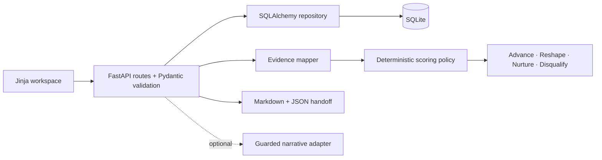

# AI Infrastructure Opportunity Workbench

[](https://github.com/daetan999/ai-infra-opportunity-workbench/actions/workflows/ci.yml)
[](LICENSE)

An evidence-led workspace for deciding whether a complex AI-infrastructure opportunity should advance, be reshaped, be nurtured, or stop.


*The portfolio view puts qualification, the latest sourced signal, and the next evidence-producing action on one review surface.*

This is a local-first portfolio implementation built with fictional scenarios. It demonstrates opportunity discovery and qualification logic without representing customer activity, revenue, deployments, or pipeline.

## The decision it supports

Technical interest is not the same as a qualified opportunity. The workbench makes the evidence behind a pursuit reviewable before a team commits solution resources.

It brings five questions into one record:

1. What workload and infrastructure constraint are being tested?
2. What measurable business consequence would make the constraint material?
3. Who owns the technical, economic, and procurement decisions?
4. Which claims are observed, confirmed, inferred, or still missing?
5. What next action will resolve an evidence gap or close the motion?

## Account review


*The seeded Northstar scenario connects a private-RAG workload hypothesis to discovery evidence. Its 67/100 score produces a **Reshape** recommendation and keeps weaker dimensions visible.*

The account workspace combines:

- a workload hypothesis with constraint, outcome, and validation measure;
- dated signals with source and provenance;
- stakeholder roles and relationship state;
- categorized discovery findings;
- a deterministic score breakdown, caps, gaps, and recommendation;
- a bounded proof-of-concept handoff in Markdown or JSON.

## Qualification workflow


Activity does not increase the score. The engine evaluates ten qualification areas, each worth up to 10 points:

| Qualification area | Maximum | Evidence sought |
|---|---:|---|
| Measurable pain | 10 | A specific operational constraint with a baseline |
| Business impact | 10 | A financial or strategic consequence with an owner |
| Technical fit | 10 | Workload constraints and acceptance criteria |
| Urgency | 10 | A dated technical or business forcing function |
| Executive sponsorship | 10 | A sponsor who can remove cross-functional blockers |
| Champion strength | 10 | An engaged advocate who can mobilize the buying group |
| Buying-process clarity | 10 | Decision criteria, approvals, and timing |
| Procurement friction | 10 | Known commercial, legal, security, or vendor steps |
| Competitive position | 10 | Alternatives, including no action, and comparison criteria |
| Access to technical evidence | 10 | Representative data, telemetry, or workload access |

Missing evidence scores zero. Hypotheses are capped at 5/10, generated suggestions at 3/10, and a high single-threading risk blocks an **Advance** recommendation. For the same ordered inputs, scoring is deterministic.

## Visual system

The interface is styled as a field-research journal rather than an AI control room:

- **olive** navigation separates the working context from the record;
- **clay** marks decisions and primary actions;
- **ivory** surfaces keep dense evidence readable;
- **Fraunces** gives decision headings an editorial voice;
- **Alegreya Sans** carries account notes and controls;
- **Azeret Mono** labels scores, states, and provenance.

Small radii, fine rules, and restrained shadows keep the product closer to a review dossier than a generic SaaS dashboard.

## Architecture



The web layer validates input and orchestrates domain services; it does not decide qualification. The repository returns detached snapshots, while the presentation mapper converts stored evidence into canonical scoring inputs. The optional narrative adapter can revise wording but cannot alter score inputs, caps, or recommendations.

See [the architecture notes](docs/architecture.md) for the entity model, request flow, and trust boundaries.

### Implementation map

```text
app/
  main.py          HTTP routes and HTML orchestration
  repository.py    SQLAlchemy persistence boundary
  scoring.py       Qualification weights, caps, and thresholds
  presentation.py  Evidence mapping, view models, and exports
  enrichment.py    Optional guarded narrative adapter
templates/         Server-rendered workspace
static/            Journal theme, layout, forms, and interactions
tests/             Unit, repository, API, and interface contracts
```

### API surface

| Method | Route | Purpose |
|---|---|---|
| `GET` | `/api/accounts` | List portfolio accounts |
| `POST` | `/api/accounts` | Create an account record |
| `POST` | `/api/accounts/{id}/signals` | Add a sourced signal |
| `PUT` | `/api/accounts/{id}/workload` | Set the workload hypothesis |
| `POST` | `/api/accounts/{id}/stakeholders` | Map a buying-group member |
| `POST` | `/api/accounts/{id}/discovery` | Add discovery evidence |
| `GET` | `/api/accounts/{id}/qualification` | Score and persist a qualification result |
| `GET` | `/api/accounts/{id}/handoff` | Build a structured PoC handoff |
| `GET` | `/api/accounts/{id}/export?format=json` | Export the structured record |
| `GET` | `/api/accounts/{id}/export?format=markdown` | Export a review brief |

Interactive OpenAPI documentation is available at `/docs` while the app is running.

## Run locally

Requires Python 3.12 or later.

```bash
git clone https://github.com/daetan999/ai-infra-opportunity-workbench.git
cd ai-infra-opportunity-workbench
python -m venv .venv
source .venv/bin/activate
python -m pip install -e '.[dev]'
cp .env.example .env
uvicorn app.main:app --reload
```

Open `http://127.0.0.1:8000`. The default configuration creates a local SQLite database and seeds three fictional scenarios.

The container runs the same application:

```bash
docker build -t opportunity-workbench .
docker run --rm -p 8000:8000 opportunity-workbench
```

## Quality checks

```bash
make lint
make test
```

`pytest` enforces an 80% minimum coverage threshold configured in `pyproject.toml`. The suite exercises scoring, persistence, workflow APIs, error states, and interface contracts. CI runs lint, tests, the coverage gate, and a clean container build.

## Data boundary and limitations

The repository contains three explicitly fictional scenarios. Runtime records stay in a local, Git-ignored SQLite database.

- Signals keep observation and provenance separate from interpretation.
- Scores and recommendations are policy outputs, not forecasts or model predictions.
- Exported handoffs remain hypotheses requiring human and customer validation.
- No customer names, confidential notes, credentials, pricing, or revenue data are included.

The public implementation is single-user and does not include authentication, authorization, CRM synchronization, migrations, rate limiting, production observability, backups, or multi-tenant isolation. Those controls would be required before storing sensitive opportunity data or hosting the application.

## License

Released under the [MIT License](LICENSE).

---

[Enterprise AI Infrastructure Portfolio](https://github.com/daetan999/technical_resume)
