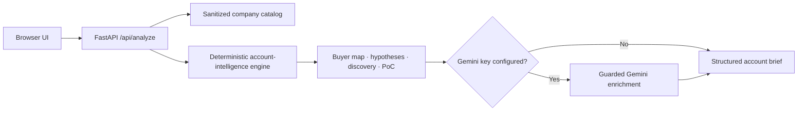

# AI Infrastructure Account Intelligence

[](#)
[](#)
[](#)
[](#)

A sanitized, runnable account-planning application for AI-infrastructure solution selling. It converts a selected company, solution motion, customer segment, and account context into a structured commercial and technical brief.

The project is deliberately not a stock-picking or options-trading application. Its primary outputs are the artifacts used to qualify and advance an infrastructure opportunity:

- Account and workload hypotheses
- Economic and technical buyer map
- Technical-to-business value paths
- Discovery questions
- Objection handling
- Falsifiable proof-of-concept criteria
- Next-step plan

## Application Scope

The built-in catalog covers companies across accelerated compute, semiconductors, AI networking, servers, cloud infrastructure, and data-center power and cooling. The public catalog contains generalized, non-confidential descriptions and synthetic sales scenarios.

The deterministic engine runs without external services. When `GEMINI_API_KEY` is present, Gemini can refine the narrative using only the structured brief already generated by the application. The model is explicitly instructed not to add deployments, contracts, customer claims, financial results, or current events.

## Architecture



## Design Decisions

| Decision | Implementation |
|---|---|
| Core workflow must work offline | Account hypotheses and sales artifacts are generated deterministically from a versioned catalog. |
| AI must not be the source of truth | Gemini receives the deterministic brief only and is restricted from adding external facts. |
| The output must support a deal motion | Every analysis includes stakeholders, discovery questions, objections, measurable outcomes, and PoC acceptance criteria. |
| Public portfolio must remain sanitized | No customer data, credentials, proprietary integrations, or internal account plans are included. |
| Technical value must connect to economics | Each opportunity hypothesis pairs an infrastructure constraint with a measurable technical and business metric. |

## Project Structure

```text
app.py                         FastAPI routes and request validation
data/catalog.py                Sanitized company and solution-motion catalog
data/account_intelligence.py   Deterministic engine and optional Gemini enrichment
templates/index.html           Server-rendered application shell
static/styles.css              Responsive professional interface
static/app.js                  API interaction and results rendering
tests/                         Offline endpoint and engine tests
docs/architecture.md           Component and control details
```

## Run Locally

```bash
python -m venv .venv
source .venv/bin/activate       # Windows: .venv\Scripts\activate
pip install -r requirements.txt
uvicorn app:app --reload
```

Open `http://127.0.0.1:8000`.

Gemini enrichment is optional:

```bash
cp .env.example .env
export GEMINI_API_KEY="your-key"
export GEMINI_MODEL="gemini-2.5-flash"
```

The application remains fully usable without these variables.

## Test

```bash
pytest -q
```

Tests do not call external APIs.

## Public-Portfolio Boundary

This repository uses generalized public-company categories and synthetic account contexts. It does not contain confidential customer discovery, pricing, contracts, internal forecasts, production credentials, or proprietary data. Generated output is an account-planning hypothesis and must be validated through real customer discovery.

## License

Released under the MIT License.
