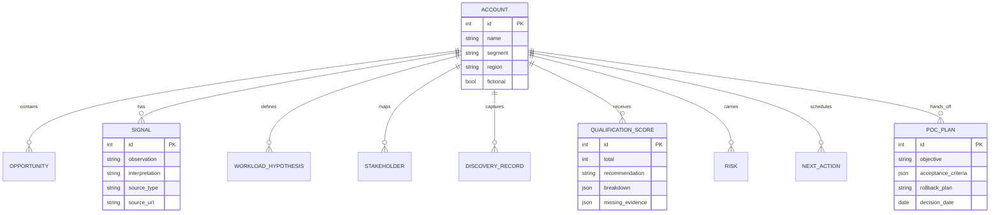
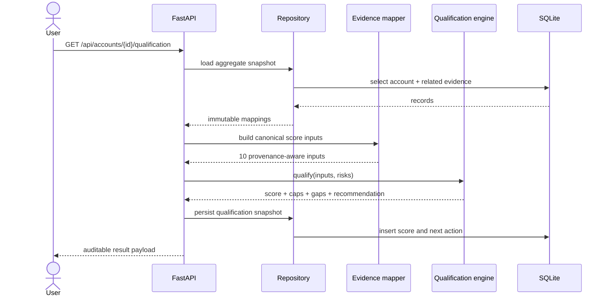

# Architecture and control boundaries

## System intent

The Opportunity Qualification & Discovery Workbench is a local-first reference application for turning AI-infrastructure discovery evidence into an explicit deal recommendation. The score is a policy decision implemented in the domain layer, not an AI prediction and not a forecast.

## Components

| Component | Responsibility | Explicit non-responsibility |
|---|---|---|
| FastAPI application | Validate HTTP input, orchestrate use cases, render HTML, return exports | Does not invent evidence or own scoring policy |
| SQLAlchemy repository | Persist accounts and related records; return detached immutable snapshots | Does not calculate opportunity quality |
| Presentation mapper | Convert persisted evidence into the ten canonical scoring inputs and view/export payloads | Does not silently upgrade provenance |
| Qualification engine | Apply weights, evidence caps, risk caps, and recommendation thresholds | Does not call a model or external service |
| Narrative adapter | Optionally refine wording from the already-structured result | Cannot change score inputs, scores, caps, or recommendation |
| Jinja workspace | Present the portfolio and account workflow | Does not store client-side source-of-truth state |

## Entity model

Related collections are append-oriented for traceability. Qualification runs are persisted as snapshots so a later reassessment does not rewrite the historical result.

## Qualification request flow

## Scoring controls

The engine evaluates pain, urgency, workload fit, buying group, decision process, competitive position, and evidence quality. Each input contains a value, provenance class, and evidence text.

Controls include:

- missing evidence contributes zero rather than being imputed;
- inferred evidence is capped below confirmed evidence;
- unsupported high-confidence assertions are rejected at validation boundaries;
- dimension weights are centralized and total 100;
- risk and ownership gaps can cap the final recommendation;
- result payloads disclose caps and missing evidence;
- repeat scoring is deterministic for the same ordered inputs.

Recommendation thresholds are policy outputs:

- **Advance** — sufficient verified evidence and no blocking cap;
- **Reshape** — a plausible opportunity with material evidence or stakeholder gaps;
- **Disqualify** — weak fit/evidence or a blocking risk that should not consume further pursuit effort.

## Data controls

- SQLite is the only default persistence dependency.
- The runtime database path is configurable through `DATABASE_URL` and excluded from Git.
- Demo seeding is controlled by `SEED_DEMO_DATA`; all bundled organizations are labeled fictional.
- Signal provenance stores source type, source URL, observation, and interpretation separately.
- Repository returns are copied into immutable mappings before crossing the persistence boundary.
- Pydantic schemas bound string lengths, enumerated fields, confidence ranges, and dates.
- Errors return user-safe messages; stack detail remains server-side.

## Narrative guardrail

`app/enrichment.py` defines an optional adapter boundary. Its input is the deterministic qualification result, and its output is narrative text labeled as model-assisted. The adapter is prohibited from adding deployments, customer claims, financial results, current events, or new score evidence. A missing or failed provider falls back to deterministic copy.

The running application does not require a model provider, and the score path never calls one.

## Deployment boundary

The provided container runs as a non-root user and exposes a health check. CI verifies lint, tests, and coverage. The public repository intentionally stops short of production controls such as authentication, authorization, secrets management, database migrations, backups, request throttling, centralized audit logging, and multi-tenant isolation. Those are required before hosting sensitive customer records.
